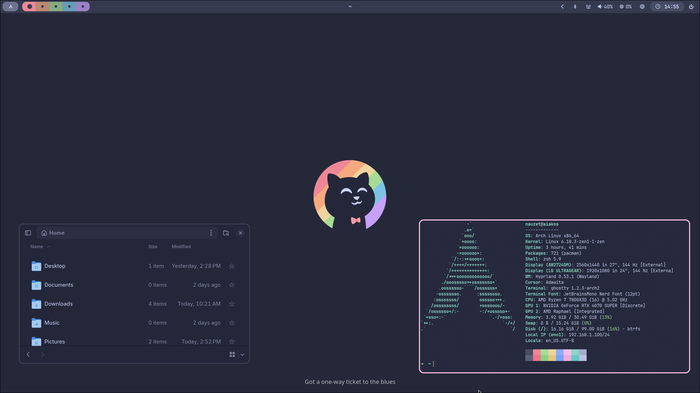

# dotfiles



## Install

```bash
pacman -S stow
```

First check out the dotfiles repo in your `$HOME`  directory using git

```
git clone git@github.com/nauzethc/dotfiles.git ~/.dotfiles
cd ~/.dotfiles
```

Then create symlinks withh `stow`

```bash
# Optional to keep directories as non symlinks
mkdir ~/.local/bin
mkdir ~/.local/share/applications
mkdir ~/.local/share/backgrounds

# Deploy dotfiles with stow
stow .
```

## Hyprland deployment (Archlinux)

To install all required packages in order to run Hyprland with this dotfiles use

```bash
cd ~/.dotfiles
./setup.sh
```

or directly from your Archlinux fresh install with

```bash
curl -fsSL https://raw.githubusercontent.com/nauzethc/dotfiles/main/install.sh | bash
```